# Architecture

`git-sage` is intentionally simple. It has one job: take a git diff, send it to a local LLM, and render the result. There are no background services, no config files, and no state; just a linear pipeline that runs inside your git hook and exits cleanly in under 30 seconds.

## High-level flow

```
git push
  └─► .git/hooks/pre-push
        └─► git-sage review --hook
              ├─► git diff --cached       → raw diff text
              ├─► build prompt            → system + user messages
              ├─► POST localhost:11434    → Ollama local API
              ├─► parse response          → structured ReviewResult
              ├─► render to terminal      → rich colored output
              └─► exit 0 (APPROVE) or exit 1 (REVISE → push aborted)
```


## Module overview

The tool is split into six single-responsibility modules:

```
git_sage/
├── cli.py       Entry point; wires all modules together via Click commands
├── diff.py      Extracts the git diff using subprocess
├── prompt.py    Builds the system + user prompt from the diff
├── ollama.py    HTTP client for Ollama's local REST API
├── parser.py    Parses the structured LLM response into a ReviewResult
└── output.py    Renders the review to the terminal using Rich
```

And one utility module:

```
git_sage/
└── hook.py      Installs and removes the .git/hooks/pre-push script
```

---

## Data flow in detail

### 1. Diff extraction (`diff.py`)

The diff is extracted by running `git diff --cached` as a subprocess. The output is a standard unified diff, the same format you see in GitHub pull requests.

The module parses the diff text to produce a `DiffResult`:

```python
@dataclass
class DiffResult:
    raw: str           # full unified diff text
    file_count: int    # number of changed files
    additions: int     # lines added
    deletions: int     # lines removed
    files: list[str]   # changed file paths
```

### 2. Prompt building (`prompt.py`)

The prompt has two parts:

**System prompt** - tells the model how to behave: act as a senior code reviewer, return a structured response with four labelled sections (SUMMARY, ISSUES, SUGGESTIONS, VERDICT), focus on correctness and security, and never flag deleted lines.

**User message** - contains the diff stats, optional developer context, and the raw diff wrapped in a code block.

Keeping prompts in a dedicated module makes them easy to iterate on without touching the rest of the codebase.

### 3. Ollama API call (`ollama.py`)

`ollama.py` is a thin wrapper around Ollama's `/api/chat` endpoint using `httpx`. It sends the messages array and returns the model's response text.

Key settings:
- `temperature: 0.2` - keeps responses deterministic and focused
- `top_p: 0.9` - slight diversity to avoid repetitive phrasing
- Timeout: 120 seconds - enough for large diffs on CPU

```python
payload = {
    "model": "qwen2.5-coder:7b",
    "messages": messages,
    "stream": False,
    "options": {"temperature": 0.2, "top_p": 0.9},
}
```

### 4. Response parsing (`parser.py`)

The system prompt instructs the model to use four labelled headings. The parser splits the response on those headings and extracts each section:

```
SUMMARY
<text>

ISSUES
1. <issue>
2. <issue>

SUGGESTIONS
1. <suggestion>

VERDICT
APPROVE | REVISE
```

The parser is tolerant of minor formatting variations: uppercase/lowercase headings, trailing colons, missing numbering. Since LLMs don't always follow instructions perfectly.

The output is a typed `ReviewResult` dataclass:

```python
@dataclass
class ReviewResult:
    summary:     str
    issues:      list[str]
    suggestions: list[str]
    verdict:     Verdict     # APPROVE | REVISE | UNKNOWN
    raw:         str         # original LLM response
```

### 5. Terminal output (`output.py`)

The `Rich` library renders the result with coloured panels, bullet points, and a verdict badge. The spinner runs during the Ollama call to show the user something is happening.

### 6. Hook integration (`hook.py`)

The pre-push hook is a small shell script:

```sh
#!/usr/bin/env sh
# git-sage managed hook
git-sage review --hook
```

When the script exits with `0`, git proceeds with the push. When it exits with `1` (REVISE verdict), git aborts the push and prints an error.

---

## Design decisions

**Why subprocess for git diff?**

It's the simplest and most reliable approach. Git is always available in the environment where the hook runs, and `git diff --cached` has a stable, well-documented output format.

**Why Ollama?**

Ollama abstracts away model loading, quantization, and hardware acceleration behind a single HTTP API. Developers can swap models with one flag and run the same code on CPU, Apple Silicon, or NVIDIA GPUs without changing anything.

**Why `qwen2.5-coder:7b`?**

It's the best code-focused model that runs on consumer hardware. It understands unified diffs natively and consistently returns structured output. General-purpose models of the same size are noticeably worse at following the structured output format reliably.

**Why `httpx` over `requests`?**

`httpx` supports both sync and async usage with the same API. The sync path is used today; async support is a natural extension for streaming output without blocking.

---

## Limitations

**Context window limits**

Every LLM has a maximum context window; the amount of text it can process in a single request. For `qwen2.5-coder:7b`, this is 32,768 tokens. A typical diff is well within this limit, but very large changesets (hundreds of files, thousands of lines) can exceed it.

If your diff is too large, Ollama will return a truncated or degraded response. To stay within safe limits:

- Review in smaller batches: `git add` a subset of files before running `git-sage review`
- Use `--diff-mode branch` to review incrementally as you work rather than all at once
- Break large features into smaller commits

A future version of git-sage could automatically chunk large diffs and aggregate the results.

**Review quality depends on the model**

The model flags what it can infer from the diff alone. It has no knowledge of your broader codebase — it can't see functions defined in other files, imported modules, or runtime behaviour. Issues that require cross-file context (e.g. a missing method defined elsewhere, or a race condition across two services) may not be caught.

Think of git-sage as a fast first pass, not a replacement for human review on critical code paths.

**Structured output is not guaranteed**

git-sage instructs the model to respond in a specific format (SUMMARY / ISSUES / SUGGESTIONS / VERDICT). Most of the time this works reliably with `qwen2.5-coder:7b`. Occasionally — especially with smaller or general-purpose models — the model may deviate from the format, resulting in an `UNKNOWN` verdict. The review is still shown, but the push is not aborted.

If you see frequent `UNKNOWN` verdicts, switch to a larger or more instruction-following model.

**CPU inference is slow on large diffs**

Without a GPU, inference time scales with diff size and model size. A small diff with `qwen2.5-coder:7b` takes 10–20 seconds on a modern CPU. A large diff with a 14B model can take several minutes. If speed is a concern, use a smaller model (`qwen2.5-coder:3b`) or invest in a machine with Apple Silicon or an NVIDIA GPU, where Ollama uses hardware acceleration automatically.
